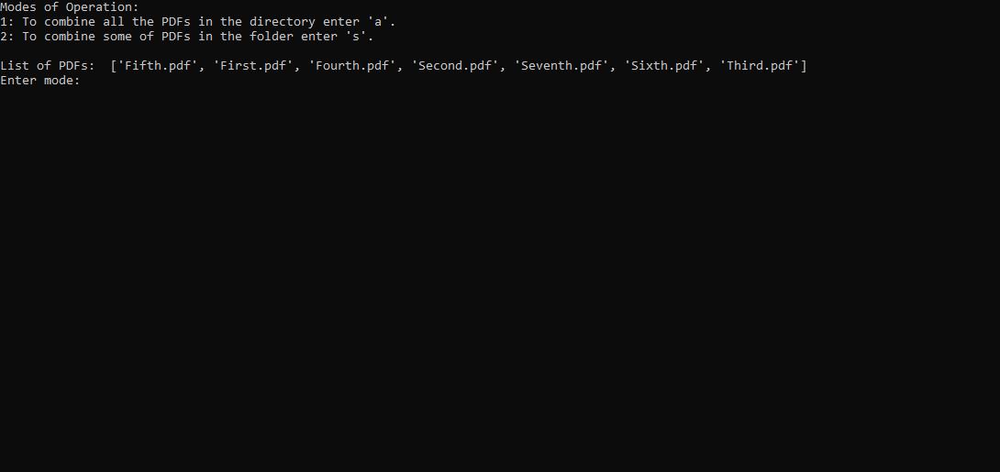
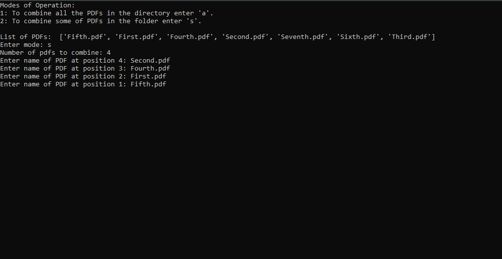
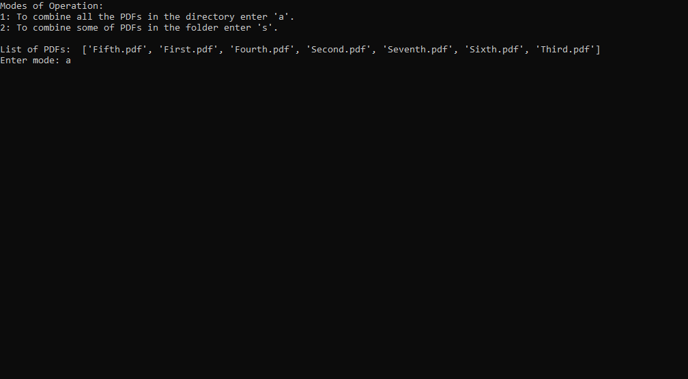
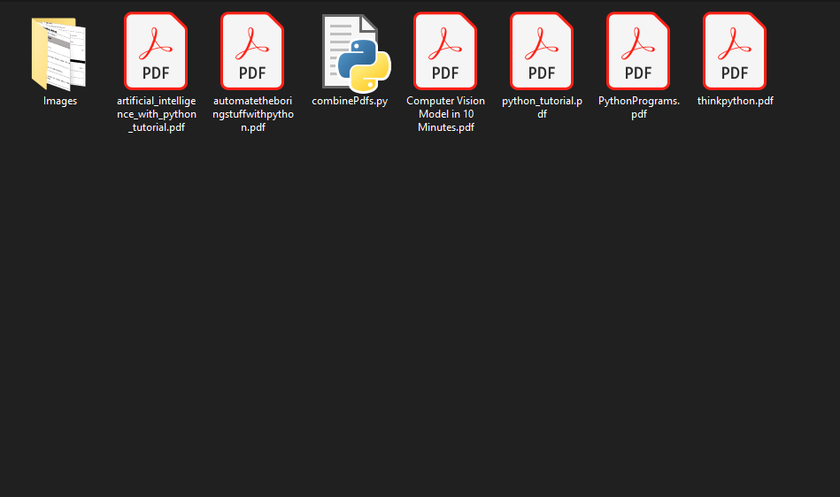
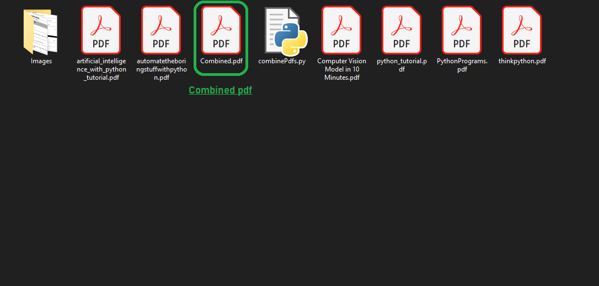


# CombinePDFs

This program will help you combine **all** or **some** of your PDF files present in you Current Working Directory and pack those PDF files inside one PDF file ;  apparently reducing a lot of time.
The packed file will be named as **Combined.pdf** .

## Prerequisites

- **Python** must be installed. To install just [click here](https://www.python.org/downloads/release/python-382/).
- Python module named **PyPDF2** must be installed. To install :
  
  - For **linux** users :
  > sudo apt-get install -y python-pypdf2
  - For **windows** users :
  > pip install pypdf2

## Installation and Usage

No installation is needed just git clone the directory and open the [CombinePDFs.py](combinePdfs.py "script") file. This script has 2 modes of operation, **_Manual and Automatic_**.

1. **Manual Mode** - A mode where the user provides name of some PDF files that are needed to be combined.

2. **Automatic Mode** - A mode where all the PDF files are combined automatically.

## Screenshots

> ### Before

> ### After

## License

[MIT](https://choosealicense.com/licenses/mit/)

---
