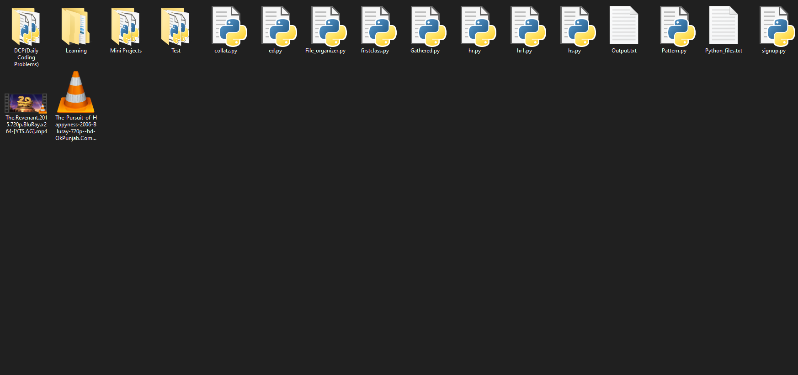

# File Organizer

This program helps you out in organizing your messed up **folder**, **desktop** etc. by packing **all** your files with same extension inside a particular folder with the name of that extension.

**Example :** If you have 6 files in a folder; 4 **python** files and 2 **audio** files, then 2 folders will be created with name **py_files** and **mp3_files** for moving your python and audio files into their respective folders.

## Prerequisites

- **Python** must be installed. To install just [click here](https://www.python.org/downloads/release/python-382/).
- Python module named **shutil** must be installed. To install :
  
  - For **windows** users :
  > pip install pytest-shutil

## Screenshots

> ### Before

> ### After

## License

[MIT](https://choosealicense.com/licenses/mit/)

---
