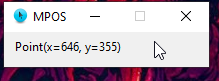

# Live Mouse Pointer

This simple script tells you the live loction of the mouse cursor.

## Prerequisites

- **Python** must be installed. To install just [click here](https://www.python.org/downloads/release/python-382/)
- Python module named **pyautogui** must be installed :
  
  - Install pyautogui:
  > pip install pyautogui

## Installation and Usage

Just git clone the directory and open the [mousepointer.pyw](mousepointer.pyw "script") file.

## Screenshot

## License

[MIT](https://choosealicense.com/licenses/mit/)

---
