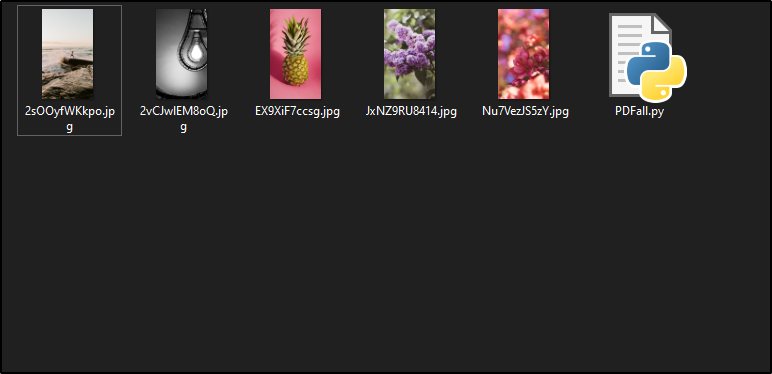
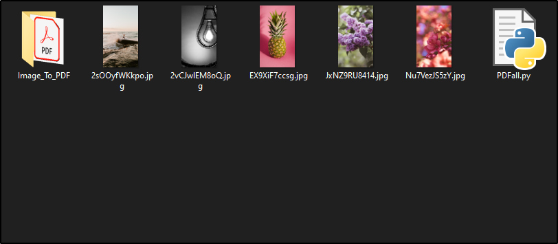

# PDFall

This simple script combines all the images in the directory in a PDF.

## Prerequisites

- **Python** must be installed. To install just [click here](https://www.python.org/downloads/release/python-382/)
- Python module named **PIL** must be installed :
  
  - Install PIL:
  > pip install pillow

## Installation and Usage

Just git clone the directory and open the [mousepointer.pyw](mousepointer.pyw "script") file.

## Screenshots

> ### Before

    

> ### After

    

## License

[MIT](https://choosealicense.com/licenses/mit/)

---
