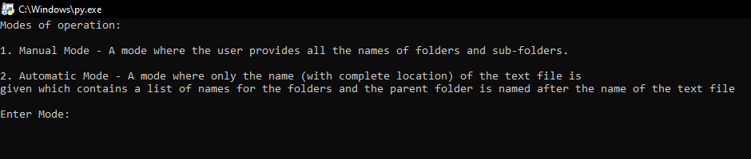
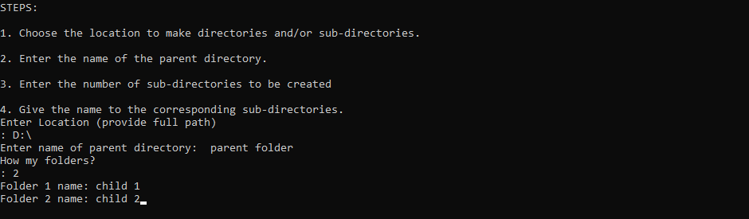
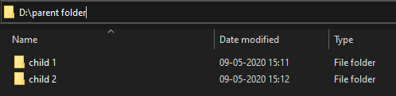
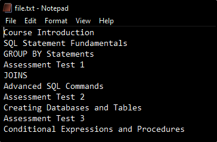
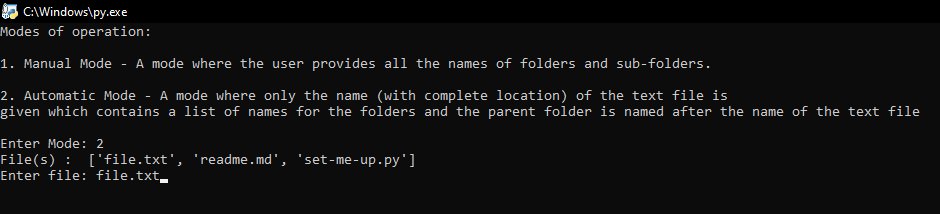
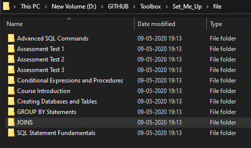

# set_folders_for_me

__set_folders_for_me__ is a Python Script for automating the creation of folders and multiple sub-folders through command line interface.

## Requirement

- **Python** must be installed. To install just [click here](https://www.python.org/downloads/release/python-382/).

## Installation and usage

- No installation is needed just git clone the directory and open the [set_folders_for_me.py](set_folders_for_me.py "script") file. This script has 2 modes of operation, _Manual and Automatic_.

   

   1. **Manual Mode** - A mode where the user provides all the names of folders and sub-folders. 
   
      
   
      
   
   1. **Automatic Mode** - A mode where only the name (with complete location) of the text file is given which contains a list of names for the folders and the parent folder is named after the name of the text file 
   
      
   
      
   
      

## License
[MIT](https://choosealicense.com/licenses/mit/)

---
